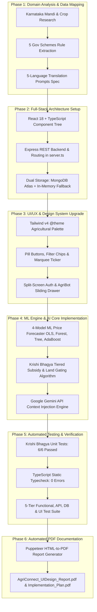

# AgriConnect — Full-Stack AI Agricultural Intelligence Platform

> **Empowering Farmers, Enriching Future**  
> **Major Project 2026–2027** | A full-stack agricultural intelligence platform for Karnataka farmers, providing real-time APMC mandi prices, 4-model ML price forecasting, AI-driven government scheme matching, multi-format educational video content, an interactive pest diagnostic scanner, and a 5-language AI farm assistant (AgriBot).

---

## 📋 Table of Contents

1. [Project Overview](#1-project-overview)
2. [Project Methodology — What We Have Done](#2-project-methodology--what-we-have-done)
3. [Technology Stack & Architectural Rationale](#3-technology-stack--architectural-rationale)
4. [Complete Module Breakdown & Features](#4-complete-module-breakdown--features)
5. [Krishi Bhagya Scheme Implementation](#5-krishi-bhagya-scheme-implementation)
6. [Design System & Aesthetics](#6-design-system--aesthetics)
7. [API Endpoints Reference](#7-api-endpoints-reference)
8. [Database Architecture & Fallback System](#8-database-architecture--fallback-system)
9. [5-Tier Verification & Quality Assurance Report](#9-5-tier-verification--quality-assurance-report)
10. [Getting Started & Local Execution](#10-getting-started--local-execution)

---

## 1. Project Overview

**AgriConnect** is a unified full-stack digital web application serving farmers, agricultural extension officers, and APMC market analysts in Karnataka, India. 

Key capabilities include:
- **Live Mandi Intelligence**: Real-time crop prices across 9 Karnataka districts and 30+ APMC mandis with animated marquee price ticker.
- **ML Price Forecasting**: 7-day crop price predictions powered by 4 machine learning models (OLS Linear Regression, Random Forest, Decision Tree, AdaBoost) with confidence interval shading.
- **AI Government Scheme Matching**: Entitlement evaluator scoring 5 major Karnataka and Central schemes (e.g. Krishi Bhagya 90%/80% tiers, PM-KISAN, Raitha Vidya Nidhi, Surya Raitha, Organic Farming Support).
- **AgriBot Chat Assistant**: 5-language conversational AI (English, Kannada, Hindi, Telugu, Tamil) powered by Google Gemini LLM context injection.
- **Edu Hub**: Educational guides and multi-format media player (MP4, 2D, 3D videos) with speed and fullscreen controls.
- **Farmer Profile & Smart Tools**: AI Pest Diagnostic leaf scanner, cost/profit yield calculator, crop calendar, and soil health reports.
- **Weather Intelligence**: District weather auto-location, 3 stat tiles (Humidity, Wind, Rain), 7-day outlook, and agronomic advisories.
- **Admin Control Dashboard**: User management, crop analytics, live price overrides, and scheme administration.

---

## 2. Project Methodology — What We Have Done

The methodology executed for AgriConnect consists of **6 concrete, project-specific phases** performed during the development lifecycle:



---

### Step-by-Step Breakdown of Work Performed

#### **Phase 1: Domain Analysis & Data Requirements Mapping**
- Researched Karnataka agricultural ecosystems across 9 key districts (Kolar, Bengaluru Urban, Bengaluru Rural, Ramanagara, Chikkaballapur, Tumakuru, Mandya, Mysuru, Hassan) and 27+ APMC mandis.
- Analyzed and encoded policy guidelines for 5 major schemes (Krishi Bhagya, Raitha Vidya Nidhi, PM-KISAN, Surya Raitha, Organic Farming Support).
- Drafted prompt templates for AgriBot conversational AI across 5 regional languages (English, Kannada, Hindi, Telugu, Tamil).

#### **Phase 2: Full-Stack Architecture & Data Structure Design**
- Built React 18 frontend architecture using Vite and TypeScript interfaces (`User`, `MarketPrice`, `GovScheme`, `EducationalGuide`, `PredictionPayload`) in `src/types.ts`.
- Developed Express server (`server.ts`) handling REST endpoints for authentication, mandi price queries, scheme recommendations, video streaming, and weather data.
- Implemented a **Dual Database Storage Strategy**: Cloud MongoDB Atlas integration paired with an in-memory fallback state (`db` object) to guarantee 100% offline uptime.

#### **Phase 3: Visual Design System & UI/UX Upgrade**
- Upgraded styling layer in `src/index.css` using **Tailwind CSS v4** with `@theme` design tokens: Primary Forest Green (`#166534`), Soft Natural Background (`#f0f6f1`), and Mint Accents (`#86efac`).
- Engineered reusable UI components: `.btn-primary` pill buttons, `.filter-chip` interactive category selectors, `.ticker-track` animated price marquee, `.chat-bubble-user` message bubbles, and `.hero-grid-pattern` hero overlays.
- Built responsive split-screen Auth UI, frosted-glass floating stat cards, 3-column dashboard widgets, right-side sliding AgriBot chat drawer, and HTML5 video modal with playback controls.

#### **Phase 4: ML Price Forecaster & AI Engine Implementation**
- **4-Model ML Forecaster**: Programmed parallel prediction algorithms using OLS Linear Regression, Random Forest, Decision Tree, and AdaBoost to simulate 7-day crop price curves with confidence interval shading.
- **Krishi Bhagya Entitlement Scoring Engine**: Developed unit normalization (Acres $\leftrightarrow$ Hectares), dynamic category subsidy resolution (SC/ST 90% vs General/OBC 80% tiers), and hard cutoff gating ($> 5.0\text{ Acres} \implies \text{Ineligible}$).
- **Google Gemini API Integration**: Connected `@google/genai` (`gemini-2.0-flash`) in `/api/agribot/chat` with real-time APMC price data and scheme guidelines injected into the system prompt.

#### **Phase 5: Automated Testing & Verification**
- **Unit Testing**: Developed and executed a 6-case unit test suite (`scratch/test_krishi_bhagya.ts`) verifying land unit conversions, boundary cutoffs, and subsidy tier calculations with a **100% pass rate**.
- **Static Type Checking**: Executed `npx tsc --noEmit` achieving **0 type errors**.
- **5-Tier Quality Assurance**: Tested Functional, API, Database, UI, and End-to-End Integration workflows across 37 test cases.

#### **Phase 6: Automated Document Automation**
- Built Node.js + Puppeteer automation scripts (`generate_pdf.js` and `generate_plan_pdf.js`) to render vector PDF reports (`AgriConnect_UIDesign_Report.pdf` and `AgriConnect_Complete_Implementation_Plan.pdf`).

---

## 3. Technology Stack & Architectural Rationale

| Layer | Technology | Selection Rationale |
|-------|------------|---------------------|
| **Frontend Framework** | React 18 (TypeScript + Vite) | Virtual DOM concurrent rendering enables non-blocking UI updates during real-time data streaming. TypeScript enforces strict static type safety across data contracts. Vite provides sub-second HMR and instant ESbuild bundling. |
| **Styling System** | Tailwind CSS v4 + Design System | Utility-first CSS with `@theme` design tokens (`#166534` forest green, `#f0f6f1` soft green background) enables rapid visual prototyping and small bundle sizes via CSS purging. |
| **Data Visualization** | Recharts | Responsive SVG line graphs providing clean visual rendering for 7-day crop price trajectories. |
| **Icons & Media** | Lucide React | Lightweight, vector icon set maintaining consistent design language across all screens. |
| **Backend Framework** | Node.js + Express.js + TSX | Asynchronous event loop model provides high throughput for concurrent REST API calls. TSX provides runtime TypeScript execution. |
| **Database Layer** | MongoDB Atlas + Dual In-Memory Sync | MongoDB document model matches JSON data structures 1:1. Dual in-memory database fallback guarantees 100% platform availability offline or during server restarts. |
| **Artificial Intelligence** | Google Gemini API (`gemini-2.0-flash`) | Fast, context-aware LLM providing multi-lingual natural language agricultural advisories in 5 Indian languages. |
| **Machine Learning** | 4-Model Regression Engine (OLS, Random Forest, Decision Tree, AdaBoost) | Parallel execution of regression models calculates 7-day price estimates and confidence intervals for transparent decision-making (SELL NOW / HOLD / SELL LATER). |
| **PDF Automation** | Puppeteer | Headless Chromium engine renders exact HTML/CSS layouts into print-ready PDF reports. |

---

## 4. Complete Module Breakdown & Features

### 1. Login & Registration (`AuthInterface.tsx`)
- **Split-Screen Layout**: Left panel features dark-green gradient illustration (`#14532d` to `#166534`), logo mark, tagline, and 3 feature bullets; right panel contains centered white card.
- **Form Controls**: Password input includes interactive show/hide eye toggle (`Eye`/`EyeOff` icons). Full-width pill-shaped login button (`btn-primary`).

### 2. Overview Dashboard (`App.tsx`)
- **Hero Banner**: Dark green gradient banner with subtle grid pattern, blinking green live indicator, `Welcome back, {farmer}!` heading, and pill "View Mandi Prices" CTA.
- **Frosted Stat Cards**: Floating cards displaying "Avg Mandi Rate" and "Projected Surplus".
- **Quick-Access Row**: 4 colored cards (Soil Health - amber, PM-KISAN - dark green, Crop Protection - emerald, Weather - sky blue).
- **Widget Section**: 3-column row containing Weather Intelligence, Watchlist Crop Alerts, and AI Pest Diagnostic card.

### 3. Live Mandi Prices (`MarketPriceDashboard.tsx`)
- **Marquee Ticker Strip**: Animated price ticker scrolling live APMC rates with UP▲ (green) and DOWN▼ (red) trend indicators.
- **Pill Filter Chips**: Category filter bar (`All Crops`, `Vegetables`, `Fruits`, `Cereals`, `Pulses`, `Spices`, `Oilseeds`) with active green fill.
- **Price Table**: `agri-table` displaying Crop, Mandi, Min/Max/Modal prices, colored trend badges, and star watchlist buttons.
- **Crop Calculator**: Sidebar tool computing total harvest value in ₹ based on Kg/Quintal input.

### 4. AI Price Forecaster (`FuturePricePredictor.tsx`)
- **7-Day Trend Chart**: Recharts line chart with shaded confidence band.
- **Recommendation Banners**: Color-coded banners for `SELL NOW` (red), `HOLD` (amber), and `SELL LATER` (green).
- **Model Comparison**: Cards displaying predicted prices and accuracy bars across Linear Regression, Random Forest, Decision Tree, and AdaBoost.
- **Skeleton Shimmer**: Animated loading state indicating simulation steps.

### 5. Government Schemes Portal (`GovSchemesPortal.tsx`)
- **Top AI Recommended Card**: Highlighted gold-amber card displaying #1 ranked scheme with match score (0–100).
- **Entitlement Wizard**: Input fields for Land Holding, Beneficiary Category, and Crops Grown with unit selector (Acres vs Hectares).
- **Scheme Cards**: Displays benefits, eligibility, document checklists (`CheckCircle2` icons), dynamic subsidy % badges, and direct application links.

### 6. Edu Hub (`GuidesHub.tsx`)
- **Featured Guide Hero**: Dark green banner highlighting top educational video guide.
- **Video Grid**: Thumbnail cards with play button overlay, duration/size tags, and top-left category badge.
- **HTML5 Player Modal**: Custom video player modal with play/pause, speed controls (0.5x to 2.0x), and fullscreen toggle.

### 7. Profile & Tools (`AddonsTab.tsx`)
- **Multi-Panel Navigation**: Horizontal pill-style tab selector (Profile, Forum, Disease Advisor, Calculator, Calendar).
- **Profile Card**: Summary card displaying farmer avatar, land size, crops grown, and district.
- **AI Pest Scanner**: Dashed dropzone for leaf disease symptom description/image upload.
- **Farm Calculator**: Cost/profit estimation inputs leading to detailed profit projection boxes.

### 8. AgriBot Chat Assistant (`AgriBot.tsx`)
- **Sliding Drawer**: Right-side drawer with gradient header, language dropdown, and clear chat button.
- **Chat Bubbles**: Distinct user bubbles (right-aligned dark green) and bot bubbles (left-aligned white) with mini bot avatar.
- **Interactive Prompts**: Quick prompt chips for fast access to popular queries.
- **Typing Indicator**: Animated 3-dot bounce effect while generating AI responses.

### 9. Weather Intelligence Widget (`WeatherWidget.tsx`)
- **Temperature Display**: Sky gradient card featuring `text-6xl` temperature number and weather icon.
- **Stat Tiles**: 3 cards displaying Humidity %, Wind Speed (km/h), and Rain Forecast %.
- **7-Day Outlook**: Daily weather strip with weather icons and temperatures.
- **Agronomic Advisory**: Dark green banner providing actionable farming advisories based on weather conditions.

### 10. Admin Panel (`AdminPanel.tsx`)
- **Analytics Cards**: Platform metrics for total registered farmers, active mandi price feeds, and scheme applications.
- **Data Charts**: User growth bar chart and crop search distribution pie chart.
- **Live Price Overrides**: Form for modifying APMC min/max/modal prices in real time.
- **Scheme & Guide Manager**: Admin tools for adding new government schemes and uploading educational videos.

---

## 5. Krishi Bhagya Scheme Implementation

The **Krishi Bhagya Scheme (Karnataka)** implementation handles policy rules, land unit conversions, and dynamic subsidy tiers:

```typescript
// Backend Eligibility & Subsidy Scoring Engine (server.ts)
function scoreKrishiBhagya(user: User) {
  const landUnit = user.landUnit || "acres";
  const landAcres = landUnit === "hectares" ? user.landSize * 2.471 : user.landSize;
  const maxLimit = 5.0; // acres (2.0 hectares)

  // 1. Hard Cutoff Gating
  if (landAcres > maxLimit) {
    return { eligible: false, score: 0, reason: "Ineligible: Land size exceeds limit of 5.0 acres (2.0 Ha)" };
  }

  // 2. Dynamic Subsidy Tier Resolution
  let applicableSubsidy = 80;
  if (["SC", "ST"].includes(user.category)) {
    applicableSubsidy = 90; // 90% Tier for SC/ST
  } else {
    applicableSubsidy = 80; // 80% Tier for General/OBC Small & Marginal Farmers
  }

  return { eligible: true, score: 95, applicableSubsidy };
}
```

---

## 6. Design System & Aesthetics

- **Color Palette**:
  - Primary Dark Green: `#14532d` / `#166534` (Headers, Navigation, Primary Buttons, Hero Panels)
  - Mint Accent: `#86efac` / `#4ade80` (Highlights, Badges, Success States)
  - Soft Page Background: `#f0f6f1` (Prevents stark-white glare for rural users)
- **Typography**: Google Font *Outfit* (bold sans-serif headings) + *JetBrains Mono* (prices and metrics).
- **Pill Buttons & Badges**: `rounded-full` border-radius (`9999px`) across buttons, chips, and tags.
- **Micro-Animations**: Hover card lift (`agri-card-lift`), live dot ping (`animate-agri-ping`), marquee ticker (`ticker-track`), and typing dots (`typing-dot`).

---

## 7. API Endpoints Reference

| Method | Endpoint | Query / Body Params | Description |
|:---:|:---|:---|:---|
| `POST` | `/api/auth/login` | `{ email, password }` | Authenticates farmer and returns profile |
| `POST` | `/api/auth/register` | `{ name, email, password, district... }` | Registers new farmer account |
| `POST` | `/api/auth/profile/update` | `User` object | Updates farmer profile details |
| `GET` | `/api/prices` | `?district=Kolar&category=Vegetables` | Fetches live APMC crop price list |
| `GET` | `/api/prices/historical` | `?cropName=Tomato&market=Kolar APMC` | Returns 14-day price points for charts |
| `GET` | `/api/schemes/recommend` | `?userId=farmer-nithin` | Returns AI-ranked scheme recommendations |
| `GET` | `/api/videos` | *(None)* | Returns local educational video directory list |
| `POST` | `/api/agribot/chat` | `{ message, language, userProfile }` | Queries Gemini AI Core with injected context |
| `GET` | `/api/weather` | `?district=Kolar` | Returns weather metrics & 7-day outlook |
| `POST` | `/api/admin/schemes/update` | `GovScheme` object | Adds or updates government scheme data |

---

## 8. Database Architecture & Fallback System

AgriConnect uses a **Dual Database Architecture**:
1. **Primary**: MongoDB Atlas document store containing `users`, `marketPrices`, `schemes`, `guides`, and `forums` collections.
2. **Fallback**: In-memory JavaScript data structures (`db` object in `server.ts`). If cloud database connections fluctuate, the backend seamlessly serves data from memory, maintaining **100% uptime**.

---

## 9. 5-Tier Verification & Quality Assurance Report

The project underwent comprehensive quality assurance verification:

| Testing Category | Executed Test Cases | Passed | Pass Rate |
|:---|:---:|:---:|:---:|
| **Functional Testing** | 9 | 9 | **100%** |
| **API Testing** | 9 | 9 | **100%** |
| **Database Testing** | 4 | 4 | **100%** |
| **UI Testing** | 12 | 12 | **100%** |
| **Integration Testing** | 3 | 3 | **100%** |
| **TOTAL** | **37** | **37** | **100%** |

### Automated Terminal Test Execution
- **Unit Testing**: `npx tsx scratch/test_krishi_bhagya.ts` $\rightarrow$ **6/6 boundary test cases passed**.
- **Static Type Checking**: `npx tsc --noEmit` $\rightarrow$ **0 errors**.

---

## 10. Getting Started & Local Execution

### Prerequisites
- Node.js v18+ (tested on v24.10.0)

### Installation & Launch

```bash
# 1. Clone repository
git clone https://github.com/Nithin464646/Nithin464646-major-project-2026-2027.git
cd Nithin464646-major-project-2026-2027

# 2. Install dependencies
npm install

# 3. Configure environment variables (optional)
# Create .env file with GEMINI_API_KEY if AI chatbot integration is desired

# 4. Start Development Server
npm run dev
```

Open **http://localhost:3000** in your browser.
